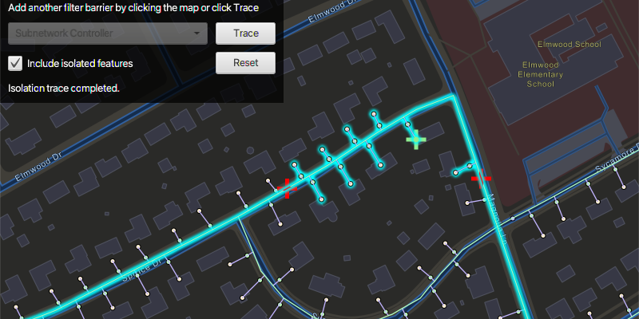

# Perform valve isolation trace

Run a filtered trace to locate operable features that will isolate an area from the flow of network resources.

## Use case

Determine the set of operable features required to stop a network's resource, effectively isolating an area of the network. For example, you can choose to return only accessible and operable valves: ones that are not paved over or rusted shut.

## How to use the sample

Create and set the configuration's filter barriers by selecting a category. Check or uncheck 'Include Isolated Features'. Click 'Trace' to run a subnetwork-based isolation trace.

## How it works

1. Create an `ArcGISMap` and add it to a `MapView`.
2. Using the URL to a utility network's feature service, create `FeatureLayer`s that contain the utility network's features, and add them to the operational layers of the map.
3. Create and load a `UtilityNetwork` with the same feature service URL and map.
4. Get a default `UtilityTraceConfiguration` from a given tier in a domain network. Set its filter with a new `UtilityTraceFilter`.
5. Create a `UtilityElement` to represent a default starting location from the `UtilityNetwork`, using a given asset type and global ID.
6. Use `utilityNetwork.fetchFeaturesForElementsAsync()` to obtain the `Geometry` of this element, and create a `Graphic` with that geometry.
7. Add a `GraphicsOverlay` with the graphic that represents the starting location.
8. Populate the combo box for choosing the filter barrier category from `UtilityNetworkDefinition.getCategories()`.
9. When "Trace" is clicked,
    - Create a new `UtilityCategoryComparison` with the selected category and `UtilityCategoryComparisonOperator.EXISTS`. 
    - Assign this condition to `utilityTraceFilter.setBarriers()` from the default configuration from step 7. Update this configuration's `utilityTraceConfiguration.isIncludeIsolatedFeatures()` property.
    - Create a `UtilityTraceParameters` with `UtilityTraceType.ISOLATION` and default starting location from step 4. 
    - Set its utility trace configuration with this configuration and then, run a `utilityNetwork.traceAsync()`.
10. Get the list of `UtilityElement`s from the first trace result.
11. For every feature layer in the map, select all the features for which the layer's `FeatureTable.getTableName()` matches the `NetworkSource.getName()` of one of the utility elements.

## Relevant API

* UtilityCategory
* UtilityCategoryComparison
* UtilityCategoryComparisonOperator
* UtilityDomainNetwork
* UtilityElement
* UtilityElementTraceResult
* UtilityNetwork
* UtilityNetworkDefinition
* UtilityTraceFilter
* UtilityTier
* UtilityTraceParameters
* UtilityTraceResult
* UtilityTraceType

## About the data

The [Naperville gas](https://sampleserver7.arcgisonline.com/server/rest/services/UtilityNetwork/NapervilleGas/FeatureServer) network feature service, hosted on ArcGIS Online, contains a utility network used to run the isolation trace shown in this sample.
    
## Tags

category comparison, condition barriers, isolated features, network analysis, subnetwork trace, trace configuration, trace filter, utility network